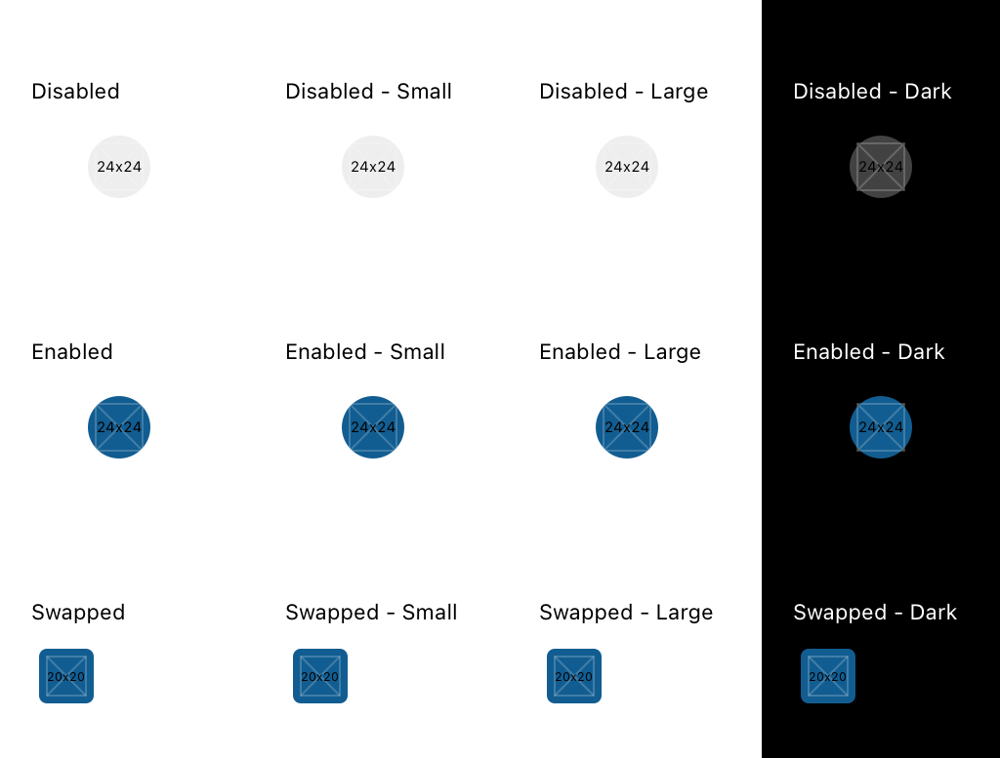
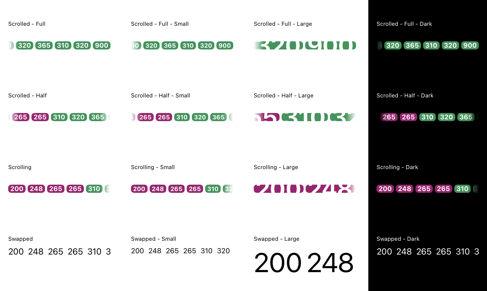
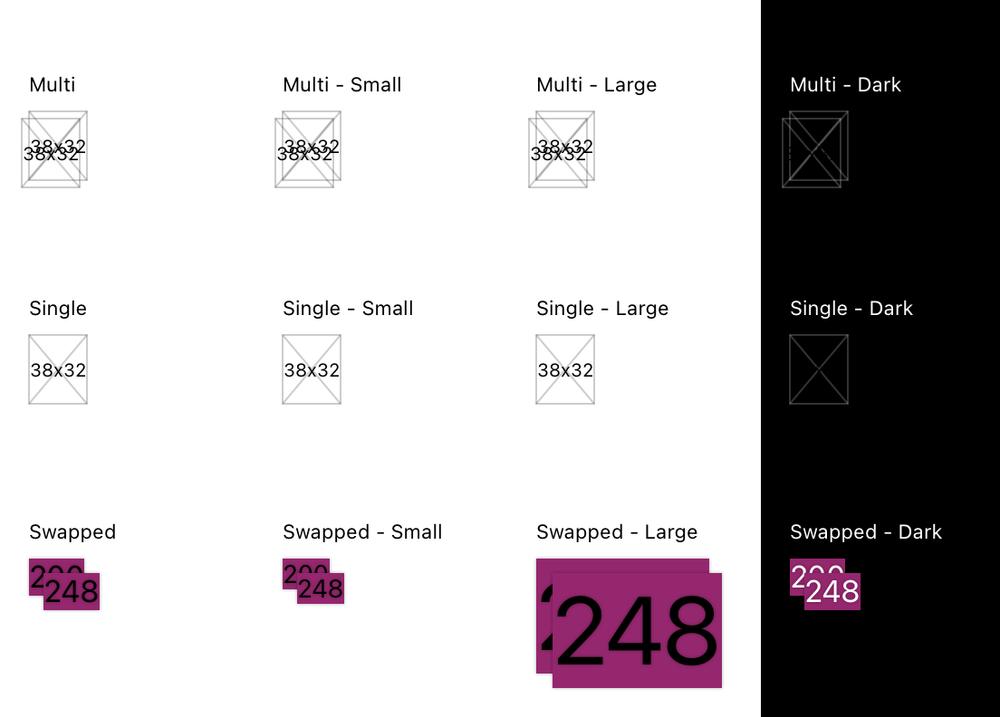
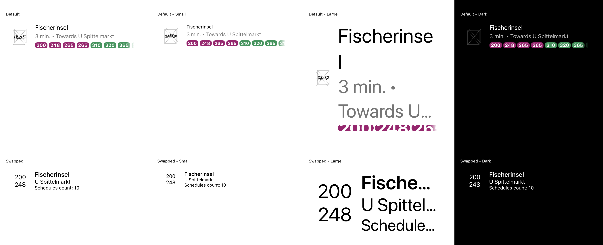

# MaasNearbyTransit

## FilterItem

### Description:
We're using this component in FilterView which allows us to filter wanted nearby filter transport types.

### Modify with: 
[embedmd]:# (../../common/core/src/commonMain/kotlin/com/trafi/maas/transit/ui/internal/NearbyTransitFilterItemConstants.kt kotlin /class / $)
```kotlin
class NearbyTransitFilterItemConstants(theme: CurrentTheme) {
    val disabledColor = theme.colorPalette.grayScale.gray200
    val itemMinHeight = 48.dp
    val itemMinWidth = 48.dp
    val contentMinHeight = 32.dp
    val contentMinWidth = 32.dp
    val imageHeight = 24.dp
    val imageWidth = 24.dp
    val cornerRadius = CornerRadiusScale.round
}
```

### Construct with:
[embedmd]:# (../../common/core/src/commonMain/kotlin/com/trafi/core/model/ext/FilterItem.kt kotlin /class / $)
```kotlin
class FilterItem(
    @SerialName(value = "id") val id: kotlin.String,
    @SerialName(value = "name") val name: kotlin.String,
    @SerialName(value = "icon") val icon: kotlin.String,
    @SerialName(value = "color") val color: kotlin.String,
    @SerialName(value = "accentColor") val accentColor: kotlin.String,
    @SerialName(value = "transportsIds") val transportsIds: kotlin.collections.List<kotlin.String>
)

```

### Preview:



## FilterView

### Description:
We're using this component to show a multiple ```FilterItem``` views which allows us to select more then one filter item at the time.

### Construct with:

[embedmd]:# (../../common/core/src/commonMain/kotlin/com/trafi/core/model/ext/FilterItem.kt kotlin /class / $)
```kotlin
class FilterItem(
    @SerialName(value = "id") val id: kotlin.String,
    @SerialName(value = "name") val name: kotlin.String,
    @SerialName(value = "icon") val icon: kotlin.String,
    @SerialName(value = "color") val color: kotlin.String,
    @SerialName(value = "accentColor") val accentColor: kotlin.String,
    @SerialName(value = "transportsIds") val transportsIds: kotlin.collections.List<kotlin.String>
)

```

```swift
public init(items: [FilterItem], didTapItem: @escaping (FilterItem.ID) -> (), disabledItems: Set<FilterItem.ID>) {
    self.items = items
    self.didTapItem = didTapItem
    self.disabledItems = disabledItems
}
```

### Preview:


## ScheduleBadgesScrollView

### Description:
We're using this component to show schedules that belong to specific stop.

### Modify with: 
[embedmd]:# (../../common/core/src/commonMain/kotlin/com/trafi/maas/transit/ui/internal/NearbyTransitScheduleBadgesConstants.kt kotlin /class / $)
```kotlin
class NearbyTransitScheduleBadgesConstants(theme: CurrentTheme) {
    val spacing = SpacingScale.xxs
}
```

### Construct with:
[embedmd]:# (../../common/core/src/commonMain/kotlin/com/trafi/core/model/Schedule.kt kotlin /class / $)
```kotlin
class is auto generated by OpenAPI Generator (https://openapi-generator.tech).
* https://openapi-generator.tech
* Do not edit the class manually.
*/
package com.trafi.core.model

import kotlinx.serialization.*
/**
 *
 * @param id
 * @param name Line number/name
 * @param color
 * @param transportId
 * @param longName
 * @param textColor
 * @param transportType
 */
@Serializable
data class Schedule(
    @SerialName(value = "id") @Required val id: kotlin.String,
    /* Line number/name */
    @SerialName(value = "name") @Required val name: kotlin.String,
    @SerialName(value = "color") @Required val color: kotlin.String,
    @SerialName(value = "transportId") @Required val transportId: kotlin.String,
    @SerialName(value = "longName") val longName: kotlin.String? = null,
    @SerialName(value = "textColor") val textColor: kotlin.String? = null,
    @SerialName(value = "transportType") val transportType: kotlin.String? = null
)
```

```swift
public init(schedules: [Schedule]) {
    self.init(input: .init(schedules: schedules))
}
```

### Preview:



## StopBadges

Description:
We're using this component to show first two schedule badges in ListItem prefix. 

### Modify with:
[embedmd]:# (../../common/core/src/commonMain/kotlin/com/trafi/maas/transit/ui/internal/NearbyTransitStopBadgeConstants.kt kotlin /class / $)
```kotlin
class NearbyTransitStopBadgeConstants(theme: CurrentTheme) {
    val imageHeight = 38.dp
    val imageWidth = 32.dp
    val offsetXY = 8.dp
}
```

### Construct with:
[embedmd]:# (../../common/core/src/commonMain/kotlin/com/trafi/core/model/Schedule.kt kotlin /class / $)
```kotlin
class is auto generated by OpenAPI Generator (https://openapi-generator.tech).
* https://openapi-generator.tech
* Do not edit the class manually.
*/
package com.trafi.core.model

import kotlinx.serialization.*
/**
 *
 * @param id
 * @param name Line number/name
 * @param color
 * @param transportId
 * @param longName
 * @param textColor
 * @param transportType
 */
@Serializable
data class Schedule(
    @SerialName(value = "id") @Required val id: kotlin.String,
    /* Line number/name */
    @SerialName(value = "name") @Required val name: kotlin.String,
    @SerialName(value = "color") @Required val color: kotlin.String,
    @SerialName(value = "transportId") @Required val transportId: kotlin.String,
    @SerialName(value = "longName") val longName: kotlin.String? = null,
    @SerialName(value = "textColor") val textColor: kotlin.String? = null,
    @SerialName(value = "transportType") val transportType: kotlin.String? = null
)
```

```swift
public init(schedules: [Schedule]) {
    self.init(input: .init(schedules: schedules))
}
```

### Preview:



## ListItem

### Description:
We're using this component to show first two schedule badges in ListItem prefix. 

### Modify with:
[embedmd]:# (../../common/core/src/commonMain/kotlin/com/trafi/maas/transit/ui/internal/NearbyTransitListItemConstants.kt kotlin /class / $)
```kotlin
class NearbyTransitListItemConstants(theme: CurrentTheme) {
    val titleTextStyle = theme.typographyScale.textL
    val titleTextLineLimit = when (theme.accessibility.fontScale) {
        Normal -> 1
        Large, ExtraLarge -> 2
    }

    val subtitleTextStyle = theme.typographyScale.textM
    val subtitleTextColor = theme.colorPalette.grayScale.gray600
    val subtitleTextLineLimit = when (theme.accessibility.fontScale) {
        Normal -> 1
        Large, ExtraLarge -> 2
    }

    val verticalContentSpacing = SpacingScale.xs
    val verticalTextSpacing = SpacingScale.xxs
}
```

### Construct with:
[embedmd]:# (../../common/core/src/commonMain/kotlin/com/trafi/core/model/StopWithSchedulesWithDepartures.kt kotlin /class / $)
```kotlin
class is auto generated by OpenAPI Generator (https://openapi-generator.tech).
* https://openapi-generator.tech
* Do not edit the class manually.
*/
package com.trafi.core.model

import kotlinx.serialization.*
/**
 *
 * @param stop
 * @param now
 * @param scheduleDepartures
 */
@Serializable
data class StopWithSchedulesWithDepartures(
    @SerialName(value = "stop") @Required val stop: Stop,
    @SerialName(value = "now") @Required val now: kotlin.String,
    @SerialName(value = "scheduleDepartures") @Required val scheduleDepartures: kotlin.collections.List<ScheduleWithDepartures>
)
```

```swift
public init(stopWithSchedulesWithDepartures: StopWithSchedulesWithDepartures) {
    self.init(input: .init(data: stopWithSchedulesWithDepartures))
}
```

### Preview:

